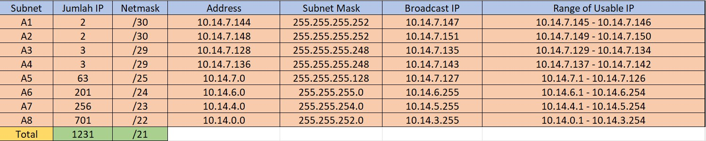
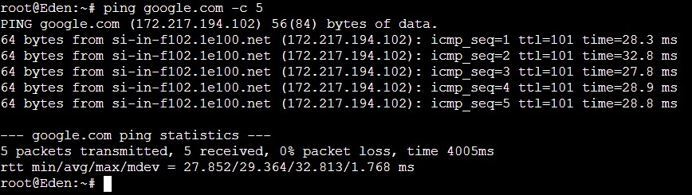
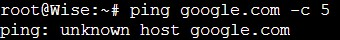
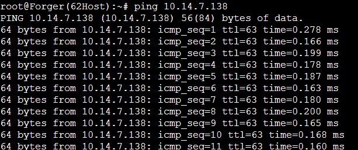
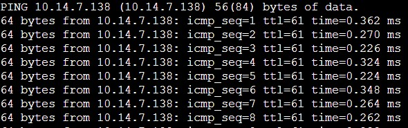
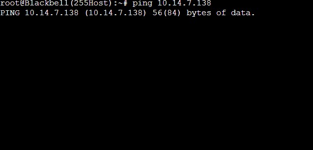
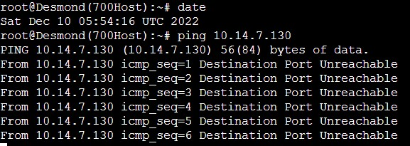
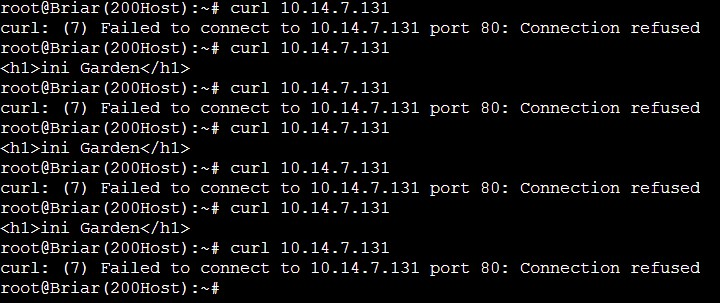

# Laporan Praktikum Jarkom Kelompok C09

## Anggota Kelompok

- 5025201089 [Andi Muhammad Rafli]
- 5025201175 [Adinda Zahra Pamuji]
- 5025201245 [Achmad Ferdiansyah]

## Table of Contents

- [Metode Perhitungan](#VLSM)
- [Konfigurasi Network Node](#nodeConfig)
- [Routing](#routing)
- [Contributing](../CONTRIBUTING.md)

## Metode Perhitungan <a name = "VLSM"></a>

Metode perhitungan yang digunakan adalah VLSM dengan langkah-langkah sebagai berikut:

- Membuat Topologi


- Menentukan Area Subnet


- Pembagian IP Subnet menggunakan Tree


- Tabel IP



## Konfigurasi Network pada Node <a name = "nodeConfig"></a>

- ### [ Strix ]

```
auto lo
iface lo inet loopback

auto eth0
iface eth0 inet dhcp

auto eth1
iface eth1 inet static
	address 10.14.7.145
	netmask 255.255.255.252

auto eth2
iface eth2 inet static
	address 10.14.7.149
	netmask 255.255.255.252
```

- ### [ Westalis ]

```
auto eth0
iface eth0 inet static
	address 10.14.7.150
	netmask 255.255.255.252
	gateway 10.14.7.149

auto eth1
iface eth1 inet static
	address 10.14.0.1
	netmask 255.255.252.0

auto eth2
iface eth2 inet static
	address 10.14.7.1
	netmask 255.255.255.128

auto eth3
iface eth3 inet static
	address 10.14.7.137
	netmask 255.255.255.248
```

- ### [ Ostania ]

```
auto eth0
iface eth0 inet static
	address 10.14.7.146
	netmask 255.255.255.252
	gateway 10.14.7.145

auto eth1
iface eth1 inet static
	address 10.14.4.1
	netmask 255.255.254.0

auto eth2
iface eth2 inet static
	address 10.14.7.129
	netmask 255.255.255.248

auto eth3
iface eth3 inet static
	address 10.14.6.1
	netmask 255.255.255.0
```

- ### [ Eden ]

```
auto eth0
iface eth0 inet static
	address 10.14.7.139
	netmask 255.255.255.248
	gateway 10.14.7.137
```

- ### [ Wise ]

```
auto eth0
iface eth0 inet static
	address 10.14.7.138
	netmask 255.255.255.248
	gateway 10.14.7.137
```

- ### [ Garden ]

```
auto eth0
iface eth0 inet static
	address 10.14.7.130
	netmask 255.255.255.248
	gateway 10.14.7.129
```

- ### [ SSS ]

```
auto eth0
iface eth0 inet static
	address 10.14.7.131
	netmask 255.255.255.248
	gateway 10.14.7.129
```

- ### [ Forger ]


```
auto eth0
iface eth0 inet static
	address 10.14.7.2
	netmask 255.255.255.128
	gateway 10.14.7.1
```
- ### [ Desmond ]


```
auto eth0
iface eth0 inet static
	address 10.14.0.2
	netmask 255.255.252.0
	gateway 10.14.0.1
```
- ### [ Briar ]


```
auto eth0
iface eth0 inet static
	address 10.14.6.2
	netmask 255.255.255.0
	gateway 10.14.6.1
```
- ### [ Blackbell ]


```
auto eth0
iface eth0 inet static
	address 10.14.4.2
	netmask 255.255.254.0
	gateway 10.14.4.1
```

## Routing

### Strix
```
# kiri ke Westalis
route add -net 10.14.7.136 netmask 255.255.255.248 gw 10.14.7.150
route add -net 10.14.7.0 netmask 255.255.255.128 gw 10.14.7.150
route add -net 10.14.0.0 netmask 255.255.252.0 gw 10.14.7.150

# kanan ke Ostania
route add -net 10.14.4.0 netmask 255.255.254.0 gw 10.14.7.146
route add -net 10.14.6.0 netmask 255.255.255.0 gw 10.14.7.146
route add -net 10.14.7.128  netmask 255.255.255.248 gw 10.14.7.146
```

### Ostania
```
route add -net 0.0.0.0 netmask 0.0.0.0 gw 10.14.7.145
```

### Westalis
```
route add -net 0.0.0.0 netmask 0.0.0.0 gw 10.14.7.149
```

## Konfigurasi Tambahan
Pada Strix, kita akan menambahkan command berikut dikarenakan kita akan menggunakan internet untuk melakukan install
```
iptables -t nat -A POSTROUTING -o eth0 -j MASQUERADE -s 10.14.0.0/21
```
Kemudian, pada node lainnya kita akan memasukkan command berikut agar node lain dapat terhubung dengan internet
```
echo nameserver 192.168.122.1 > /etc/resolv.conf
```

## Install Tools

Dikarenakan pada soal kita diminta untuk membuat:
1. Eden sebagai DNS Server
2. WISE adalah DHCP Server
3. Garden dan SSS adalah Web Server
4. Westalis dan Ostania sebagai DHCP Relay

Maka, kita akan menginstall tools yang dibutuhkan untuk server-server tersebut.

### Eden
```
apt-get update
apt-get install nano
apt-get install bind9 -y
```
### Wise
```
apt-get update
apt-get install nano
apt-get install isc-dhcp-server -y
```
### Garden & SSS
```
apt-get update
apt-get install nano
apt-get install apache2 -y
```
### Westalis & Ostania
```
apt-get update
apt-get install nano
apt-get install isc-dhcp-relay -y
```

## Soal D
## Tugas berikutnya adalah memberikan ip pada subnet Forger, Desmond, Blackbell, dan Briar secara dinamis menggunakan bantuan DHCP server. Kemudian kalian ingat bahwa kalian harus setting DHCP Relay pada router yang menghubungkannya.

### Westalis & Ostania

```
echo '
# Defaults for isc-dhcp-relay initscript
# sourced by /etc/init.d/isc-dhcp-relay
# installed at /etc/default/isc-dhcp-relay by the maintainer scripts

#
# This is a POSIX shell fragment
#

# What servers should the DHCP relay forward requests to?
SERVERS="10.14.7.138"

# On what interfaces should the DHCP relay (dhrelay) serve DHCP requests?
INTERFACES="eth0 eth1 eth2 eth3"

# Additional options that are passed to the DHCP relay daemon?
OPTIONS=""
' > /etc/default/isc-dhcp-relay

service isc-dhcp-relay start
```

### Wise

```
echo "
# Defaults for isc-dhcp-server initscript
# sourced by /etc/init.d/isc-dhcp-server
# installed at /etc/default/isc-dhcp-server by the maintainer scripts

#
# This is a POSIX shell fragment
#

# Path to dhcpds config file (default: /etc/dhcp/dhcpd.conf).
#DHCPD_CONF=/etc/dhcp/dhcpd.conf

# Path to dhcpds PID file (default: /var/run/dhcpd.pid).
#DHCPD_PID=/var/run/dhcpd.pid

# Additional options to start dhcpd with.
#       Don't use options -cf or -pf here; use DHCPD_CONF/ DHCPD_PID instead
#OPTIONS=""

# On what interfaces should the DHCP server (dhcpd) serve DHCP requests?
#       Separate multiple interfaces with spaces, e.g. "eth0 eth1".
INTERFACES="eth0"
" > /etc/default/isc-dhcp-server
```
```

echo "

#
# Sample configuration file for ISC dhcpd for Debian
#
# Attention: If /etc/ltsp/dhcpd.conf exists, that will be used as
# configuration file instead of this file.
#
#

# The ddns-updates-style parameter controls whether or not the server will
# attempt to do a DNS update when a lease is confirmed. We default to the
# behavior of the version 2 packages ('none', since DHCP v2 didn't
# have support for DDNS.)
ddns-update-style none;

# option definitions common to all supported networks...
# option domain-name "example.org";
# option domain-name-servers ns1.example.org, ns2.example.org;

default-lease-time 600;
max-lease-time 7200;

# If this DHCP server is the official DHCP server for the local
# network, the authoritative directive should be uncommented.
#authoritative;

# Use this to send dhcp log messages to a different log file (you also
# have to hack syslog.conf to complete the redirection).
log-facility local7;

# No service will be given on this subnet, but declaring it helps the
# DHCP server to understand the network topology.

#subnet 10.152.187.0 netmask 255.255.255.0 {
#}

# This is a very basic subnet declaration.
#subnet 10.254.239.0 netmask 255.255.255.224 {
#  range 10.254.239.10 10.254.239.20;
#  option routers rtr-239-0-1.example.org, rtr-239-0-2.example.org;
#}

# This declaration allows BOOTP clients to get dynamic addresses,
# which we don't really recommend.

#subnet 10.254.239.32 netmask 255.255.255.224 {
#  range dynamic-bootp 10.254.239.40 10.254.239.60;
#  option broadcast-address 10.254.239.31;
#  option routers rtr-239-32-1.example.org;
#}

# A slightly different configuration for an internal subnet.
#subnet 10.5.5.0 netmask 255.255.255.224 {
#  range 10.5.5.26 10.5.5.30;
#  option domain-name-servers ns1.internal.example.org;
#  option domain-name "internal.example.org";
#  option subnet-mask 255.255.255.224;
#  option routers 10.5.5.1;
#  option broadcast-address 10.5.5.31;
#  default-lease-time 600;
#  max-lease-time 7200;
#}

# Hosts which require special configuration options can be listed in
# host statements.   If no address is specified, the address will be
# allocated dynamically (if possible), but the host-specific information
# will still come from the host declaration.
#host passacaglia {
#  hardware ethernet 0:0:c0:5d:bd:95;
#  filename "vmunix.passacaglia";
#  server-name "toccata.fugue.com";
#}

# Fixed IP addresses can also be specified for hosts.   These addresses
# should not also be listed as being available for dynamic assignment.
# Hosts for which fixed IP addresses have been specified can boot using
# BOOTP or DHCP.   Hosts for which no fixed address is specified can only
# be booted with DHCP, unless there is an address range on the subnet
# to which a BOOTP client is connected which has the dynamic-bootp flag
# set.
#host fantasia {
#  hardware ethernet 08:00:07:26:c0:a5;
#  fixed-address fantasia.fugue.com;
#}

# You can declare a class of clients and then do address allocation
# based on that.   The example below shows a case where all clients
# in a certain class get addresses on the 10.17.224/24 subnet, and all
# other clients get addresses on the 10.0.29/24 subnet.

#class "foo" {
#  match if substring (option vendor-class-identifier, 0, 4) = "SUNW";
#}

#shared-network 224-29 {
#  subnet 10.17.224.0 netmask 255.255.255.0 {
	#    option routers rtr-224.example.org;
#  }
#  subnet 10.0.29.0 netmask 255.255.255.0 {
#    option routers rtr-29.example.org;
#  }
#  pool {
#    allow members of "foo";
#    range 10.17.224.10 10.17.224.250;
#  }
#  pool {
	#  }
#  pool {
#    deny members of "foo";
#    range 10.0.29.10 10.0.29.230;
#  }
#}

# Forger A5
subnet 10.14.7.0 netmask 255.255.255.128 {
        range 10.14.7.2 10.14.7.126;
        option routers 10.14.7.1;
        option broadcast-address 10.14.7.127;
		option domain-name-servers 10.14.7.139;
        default-lease-time 600;
        max-lease-time 7200;
}

# Desmond A8
subnet 10.14.0.0 netmask 255.255.252.0 {
        range 10.14.0.2 10.14.3.254;
        option routers 10.14.0.1;
        option broadcast-address 10.14.3.255;
		option domain-name-servers 10.14.7.139;
        default-lease-time 600;
        max-lease-time 7200;
}


# Blackbell A7
subnet 10.14.4.0 netmask 255.255.254.0 {
        range 10.14.4.2 10.14.5.254;
        option routers 10.14.4.1;
		option broadcast-address 10.14.5.255;
        option domain-name-servers 10.14.7.139;
        default-lease-time 600;
        max-lease-time 7200;
}


# Briar A6
subnet 10.14.6.0 netmask 255.255.255.0 {
        range 10.14.6.2 10.14.6.254;
		option routers 10.14.6.1;
        option broadcast-address 10.14.6.255;
        option domain-name-servers 10.14.7.139;
        default-lease-time 600;
        max-lease-time 7200;
}

# Routing dari Wise ke Router Westalis
subnet 10.14.7.136 netmask 255.255.255.248 {
        option routers 10.14.7.137;
		}
" > /etc/dhcp/dhcpd.conf
```
```
service isc-dhcp-server stop
service isc-dhcp-server start
```

### Eden
```
echo "
options {
        directory "/var/cache/bind";

        // If there is a firewall between you and nameservers you want
        // to talk to, you may need to fix the firewall to allow multiple
        // ports to talk.  See http://www.kb.cert.org/vuls/id/800113

        // If your ISP provided one or more IP addresses for stable
        // nameservers, you probably want to use them as forwarders.
        // Uncomment the following block, and insert the addresses replacing
        // the all-0's placeholder.
		
        forwarders {
              192.168.122.1;
        };
        //=====================================================================$
        // If BIND logs error messages about the root key being expired,
        // you will need to update your keys.  See https://www.isc.org/bind-keys
        //=====================================================================$
        //dnssec-validation auto;
        allow-query { any; };
		
        auth-nxdomain no;    # conform to RFC1035
        listen-on-v6 { any; };
};
" > /etc/bind/named.conf.options
```
```
service bind9 restart
```

## Nomor 1

## Agar topologi yang kalian buat dapat mengakses keluar, kalian diminta untuk mengkonfigurasi Strix menggunakan iptables, tetapi Loid tidak ingin menggunakan MASQUERADE.

### Strix

```
iptables -t nat -A POSTROUTING -s 10.14.0.0/21 -o eth0 -j SNAT --to-source 192.168.122.131
```
Untuk menemukan ip eth0 maka kita perlu menjalankan command `ip a` pada Strix.

### Testing



## Nomor 2

## Kalian diminta untuk melakukan drop semua TCP dan UDP dari luar Topologi kalian pada server yang merupakan DHCP Server demi menjaga keamanan.

### Strix

```
iptables -A FORWARD -p tcp -d 10.14.7.138 -i eth0 -j DROP
iptables -A FORWARD -p udp -d 10.14.7.138 -i eth0 -j DROP
```

### Testing


## Nomor 3

## Loid meminta kalian untuk membatasi DHCP dan DNS Server hanya boleh menerima maksimal 2 koneksi ICMP secara bersamaan menggunakan iptables, selebihnya didrop.

### Eden & Wise
```
iptables -A INPUT -p icmp -m connlimit --connlimit-above 2 --connlimit-mask 0 -j DROP
```

### Testing
Forger

Briar

Blackbell


## Nomor 4

## Akses menuju Web Server hanya diperbolehkan disaat jam kerja yaitu Senin sampai Jumat pada pukul 07.00 - 16.00.

### SSS & Garden

```
iptables -A INPUT -d 10.14.7.128/29 -m time --timestart 07:00 --timestop 16:00 --weekdays Mon,Tue,Wed,Thu,Fri -j ACCEPT
iptables -A INPUT -d 10.14.7.128/29 -j REJECT
```

### Testing


## Nomor 5

## Karena kita memiliki 2 Web Server, Loid ingin Ostania diatur sehingga setiap request dari client yang mengakses Garden dengan port 80 akan didistribusikan secara bergantian pada SSS dan Garden secara berurutan dan request dari client yang mengakses SSS dengan port 443 akan didistribusikan secara bergantian pada Garden dan SSS secara berurutan.

### Ostania

```
iptables -A PREROUTING -t nat -p tcp -d 10.14.7.139 --dport 80 -m statistic --mode nth --every 2 --packet 0 -j DNAT --to-destination 10.14.7.131:80
iptables -A PREROUTING -t nat -p tcp -d 10.14.7.139 --dport 80 -j DNAT --to-destination 10.14.7.130:80
iptables -t nat -A POSTROUTING -p tcp -d 10.14.7.131 --dport 80 -j SNAT --to-source 10.14.7.139
iptables -t nat -A POSTROUTING -p tcp -d 10.14.7.130 --dport 80 -j SNAT --to-source 10.14.7.139

iptables -A PREROUTING -t nat -p tcp -d 10.14.7.139 --dport 443 -m statistic --mode nth --every 2 --packet 0 -j DNAT --to-destination 10.14.7.130:443
iptables -A PREROUTING -t nat -p tcp -d 10.14.7.139 --dport 443 -j DNAT --to-destination 10.14.7.131:443
iptables -t nat -A POSTROUTING -p tcp -d 10.14.7.130 --dport 443 -j SNAT --to-source 10.14.7.139
iptables -t nat -A POSTROUTING -p tcp -d 10.14.7.131 --dport 443 -j SNAT --to-source 10.14.7.139
```
### Garden & SSS
1. Ubah Index HTML untuk menandakan Garden atau SSS
```
nano /var/www/html/index.html
```
```
ini {namaserver Garden/SSS}
```

### Testing



## Kendala
- Kami tidak dapat mengerjakan nomor 6
- Nomor 5 masih terdapat kendala dimana hasil yang diharapkan belum sesuai dengan yang seharusnya
