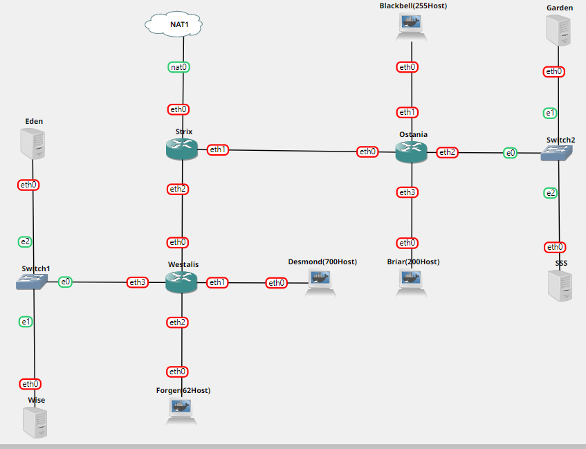
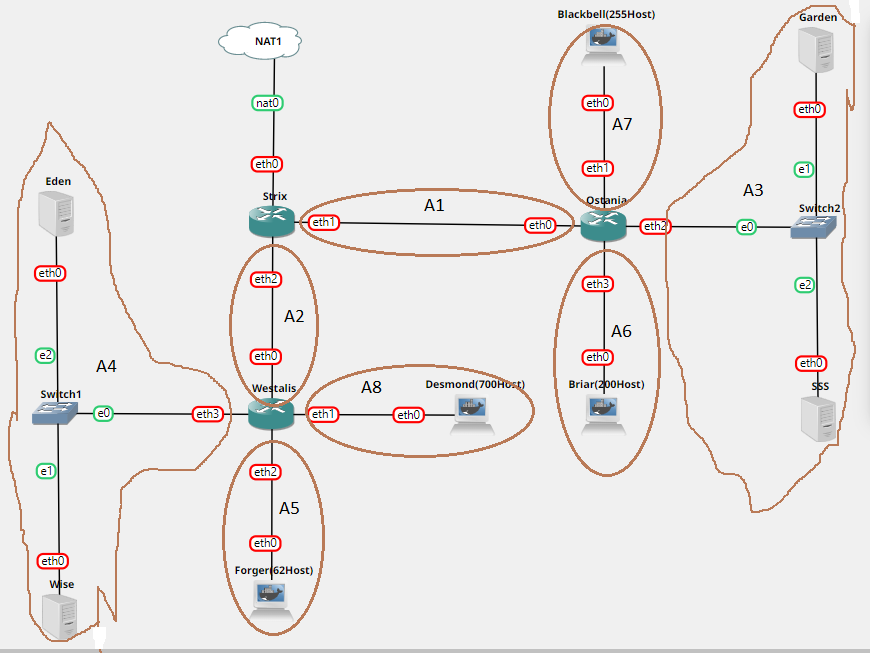
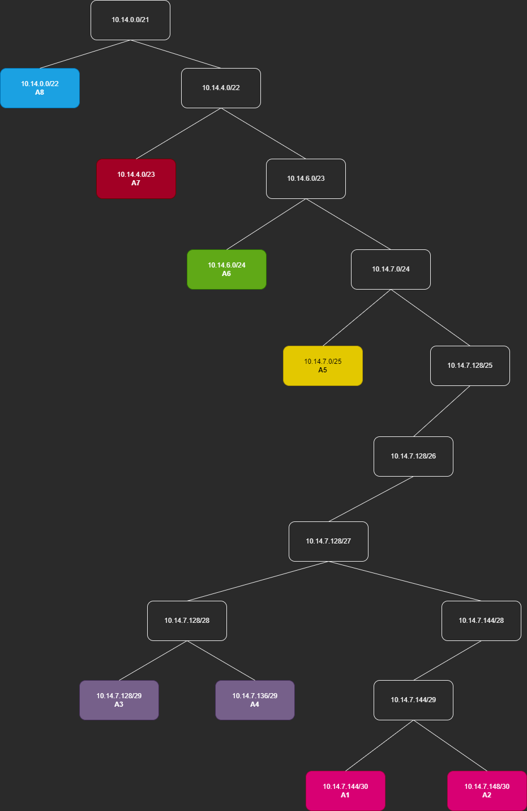

# Laporan Praktikum Jarkom Kelompok C09

## Anggota Kelompok

- 5025201089 [Andi Muhammad Rafli]
- 5025201175 [Adinda Zahra Pamuji]
- 5025201245 [Achmad Ferdiansyah]

## Table of Contents

- [Metode Perhitungan](#VLSM)
- [Konfigurasi Network Node](#nodeConfig)
- [Routing](#routing)
- [Contributing](../CONTRIBUTING.md)

## Metode Perhitungan <a name = "VLSM"></a>

Metode perhitungan yang digunakan adalah VLSM dengan langkah-langkah sebagai berikut:

- Membuat Topologi



- Menentukan Area Subnet



- Pembagian IP Subnet menggunakan Tree



## Konfigurasi Network pada Node <a name = "nodeConfig"></a>

- ### [ Strix ]

```
#Nat
auto eth0
iface eth0 inet dhcp

#A1
auto eth1
iface eth1 inet static
	address 10.14.7.145
	netmask 255.255.255.252

#A2
auto eth2
iface eth2 inet static
	address 10.14.7.149
	netmask 255.255.255.252
```

- ### [ Westalis ]

```
#A2
auto eth0
iface eth0 inet static
	address 10.14.7.150
	netmask 255.255.255.252

#A8
auto eth1
iface eth1 inet static
	address 10.14.0.1
	netmask 255.255.252.0

#A5
auto eth2
iface eth2 inet static
	address 10.14.7.1
	netmask 255.255.255.128

#A4
auto eth3
iface eth3 inet static
	address 10.14.7.137
	netmask 255.255.255.248
```

- ### [ Ostania ]

```
#A1
auto eth0
iface eth0 inet static
	address 10.14.7.146
	netmask 255.255.255.252

#A7
auto eth1
iface eth1 inet static
	address 10.14.4.1
	netmask 255.255.254.0

#A3
auto eth2
iface eth2 inet static
	address 10.14.7.129
	netmask 255.255.255.248

#A6
auto eth3
iface eth3 inet static
	address 10.14.6.1
	netmask 255.255.255.0
```

- ### [ Eden ]

```
#A4
auto eth0
iface eth0 inet static
	address 10.14.7.138
	netmask 255.255.255.248
    gateway 10.14.7.149
```

- ### [ Wise ]

```
#A4
auto eth0
iface eth0 inet static
	address 10.14.7.139
	netmask 255.255.255.248
    gateway 10.14.7.149
```

- ### [ Garden ]

```
#A3
auto eth0
iface eth0 inet static
	address 10.14.7.130
	netmask 255.255.255.248
    gateway 10.14.7.145
```

- ### [ SSS ]

```
#A3
auto eth0
iface eth0 inet static
	address 10.14.7.131
	netmask 255.255.255.248
    gateway 10.14.7.145
```

- ### [ Forger, Desmond, Blackbell, Briar ]

Semua client di set seperti ini

```
auto eth0
iface eth0 inet dhcp
```

## Routing dan Kofigurasi DNS Server, Web Server, DHCP Server dan Relay <a name = "routing"></a>

- ### [ Strix ]

```
route add -net 10.14.4.0 netmask 255.255.254.0 gw 10.45.7.146  #BLACKBELL
route add -net 10.14.6.0 netmask 255.255.255.0 gw 10.45.7.146  #BRIAR
route add -net 10.14.7.128 netmask 255.255.255.248 gw 10.45.7.146  #GARDEN & SSS

route add -net 10.14.0.0 netmask 255.255.252.0 gw 10.14.7.150  #DESMOND
route add -net 10.14.7.0 netmask 255.255.255.128 gw 10.14.7.150  #FORGER
route add -net 10.45.7.136 netmask 255.255.255.248 gw 10.14.7.150  #EDEN & WISE
```

- ### [ Ostania ]

route add -net 0.0.0.0 netmask 0.0.0.0 gw 10.14.7.145

- ### [ Westalis ]

route add -net 0.0.0.0 netmask 0.0.0.0 gw 10.14.7.149

- ### [ Eden sebagai DNS Server ] Pada File /etc/bind/named.conf.options

```
apt update
apt install bind9 -y
echo '
options {
        directory "/var/cache/bind";
        forwarders {
                192.168.122.1;  # ip nameserver STRIX
        };
        allow-query { any; };
        auth-nxdomain no;       # conform to RFC1035
        listen-on-v6 { any; };
};' > /etc/bind/named.conf.options

# restart service
service bind9 restart
```

- ### [ WISE sebagai DHCP Server ] Pada File /etc/default/isc-dhcp-server

```
apt update
apt install isc-dhcp-server -y
echo 'INTERFACES="eth0"' > /etc/default/isc-dhcp-server
```

Pada File /etc/dhcp/dhcpd.conf ketikkan

```

```

### Prerequisites

What things you need to install the software and how to install them.

```
Give examples
```

### Installing

A step by step series of examples that tell you how to get a development env running.

Say what the step will be

```
Give the example
```

And repeat

```
until finished
```

End with an example of getting some data out of the system or using it for a little demo.

## Usage <a name = "usage"></a>

Add notes about how to use the system.
